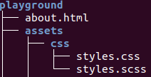

`Command name` - what it does

`cd` - change directory, with no arguments it will go to the home directory

`ls` - shows directory contents

`mkdir` - makes new directory

`mvdir` - moves directory

`mv` - moves file

`alias` - shows aliases

`cat` - displays file content

`curl` -  transfers a URL

`echo` - repeats a string variable to output

`sudo apt install something` - installs package

`sudo apt search something` - searches for package

`exit` - exits script

`find` - searches

`export` - exports to new file type

`mount` -  mounts file systems on servers. Also lists the current file systems and their mount locations

`passwd` - update password

`rm filename` - deletes file 

`rm -r dirname` - deletes directory

`grep` - grabs/searches pattern/word

`tree` - shows the file system tree

flags

