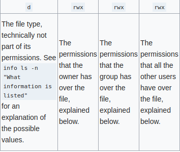

## Terminology

`directory` - A folder

`file` - A form of storing information. Files live in directories.

`program` - A set of instructions. A program can be stored on a file.

E.g. a cassette tape is like a file and the casette player is the program. Without the player, you still have the information but you need the 'program' to play it.

[Wikipedia Definition](https://en.wikipedia.org/wiki/Computer_program)

## Commands

`root directory` -  /<br>
`mkdir` - makes directory<br>
`touch` - makes empty file<br>
`cat` - reading and writing files<br>
`vim` - texteditor that can be used in terminal. VScode, etc. are text editors<br>

## cat
for long files, pipe to a pager like `less` e.g.
`cat somefile.text | less`

## less
pgup pgdn
ctrl + d = page down
crtl + u = page up
/ to search for text
n N to go between search results
q to quit

## Writing to files from the CLI / shell / terminal
echo texthere > filename (writes and overwrites) <br>
echo texthere >> filename (appends) <br> cat gcc
EOF - end of file (just a convention when used in heredocs)

e.g.
```
cat << 'EOF' >> deleteme  
hello mr bear
we are doing a task
in 365
its a nice day
EOF
```

## GCC
```
gcc -o hello hello.c
```

-o name (output name)


## Paths
. current directory
.. above directory

e.g.
```
~/web » ./hello 
```

## File Permissions

`Folder Permissions`  
``` 
Execute - can enter the folder and see what is located there but not read the contents

Read - can read the file contents  

Write - can edit the folders data, delete/create new files/folders inside
```

`File Permissions`

``` 
Execute - can run the file and get data from it

Read - can read the file

Write - can change the files data
```

## Viewing Permissions

`ls -l` - to view the permissions of a directory

The first digit of the command output represents the file type.\
`d` - directory\
`-` - file\
`l` - link



[Wiki.Archlinux](https://wiki.archlinux.org/index.php/File_permissions_and_attributes)

Each of the three permission triads can be made up of the following characters\
`- r - w - x s s t T`

## Changing Permissions

`chmod` - change the permission or access mode of a file rectory
e.g. chmod who=permissions filename
who can range from these letters
`u` - user that owns the file
`g` - user group that the file belongs to
`o` - other users
`a` - all of the able

## Opening and Executing Files

_Execute_ - to carry out; accomplish; to perform or do. [Dictionary](https://www.dictionary.com/browse/execute)

`cat hello.py` - With `r` permissions, by using this command you will execute `cat` to read the file hello.py

The difference between opening and executing a file is that 


